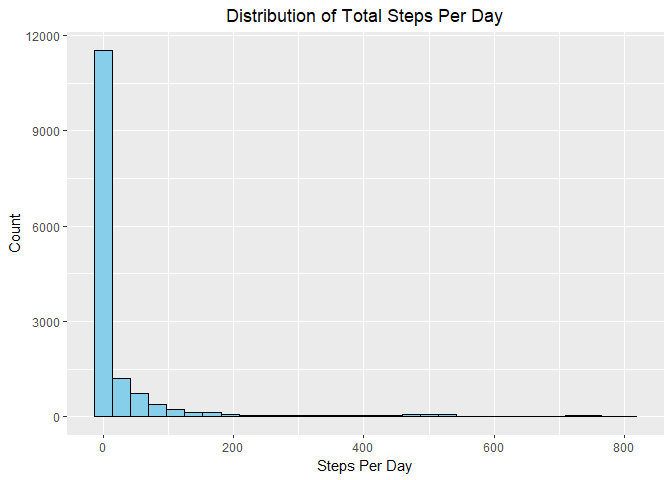
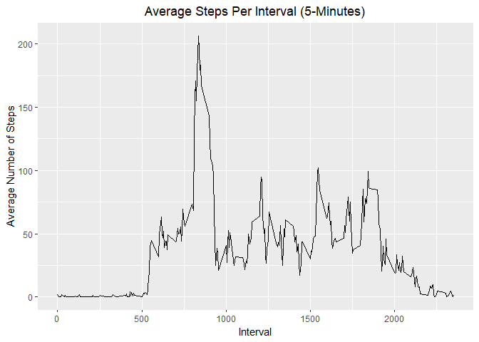
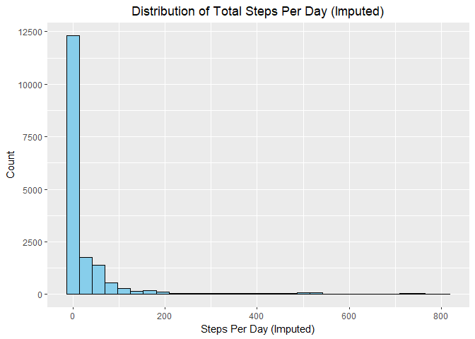
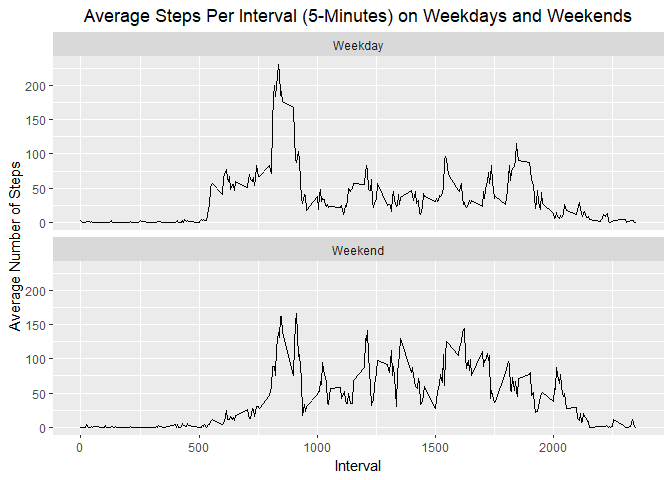

## Loading and preprocessing the data
First, we load required R packages and download and unzip the ZIP file containing the data for this analysis, if it has not already been downloaded and unzipped. Then, we read in the data.


``` r
library(readr)
library(dplyr)
library(ggplot2)
library(data.table)

url <- "https://d396qusza40orc.cloudfront.net/repdata%2Fdata%2Factivity.zip"

zipfile <- file.path(getwd(),"activity_monitoring.zip")
                     
if(!file.exists(zipfile)) {
  download.file(url, destfile = zipfile)
  unzip(zipfile)
}

activity_monitoring_file <- file.path(getwd(),"activity.csv")

activity_data <- read_csv(activity_monitoring_file)
```

```
## Rows: 17568 Columns: 3
## ── Column specification ──────────────────────────────────────────────────────────────────────────────────────────────────────────────────────────────
## Delimiter: ","
## dbl  (2): steps, interval
## date (1): date
## 
## ℹ Use `spec()` to retrieve the full column specification for this data.
## ℹ Specify the column types or set `show_col_types = FALSE` to quiet this message.
```

## What is mean total number of steps taken per day?
In total, there were 570,608 steps taken (37.4 per day on average).


``` r
total_steps <- sum(activity_data$steps, na.rm = TRUE)
print(total_steps)
```

```
## [1] 570608
```

``` r
median_steps <- median(activity_data$steps, na.rm = TRUE)
print(median_steps)
```

```
## [1] 0
```

``` r
ggplot(data = activity_data, aes(x = steps)) +
  geom_histogram(fill = "skyblue", 
                 color = "black") +
  labs(title = "Distribution of Total Steps Per Day", 
       x = "Steps Per Day", 
       y = "Count") + 
  theme(plot.title = element_text(hjust = 0.5))
```

```
## `stat_bin()` using `bins = 30`. Pick better value `binwidth`.
```

```
## Warning: Removed 2304 rows containing non-finite outside the scale range (`stat_bin()`).
```

<!-- -->

The mean number of steps taken per day is approximately 37.4 steps. The median number of steps taken per day is 0 steps:


``` r
mean_steps <- mean(activity_data$steps, na.rm = TRUE)
print(mean_steps)
```

```
## [1] 37.3826
```

``` r
median_steps <- median(activity_data$steps, na.rm = TRUE)
print(median_steps)
```

```
## [1] 0
```


## What is the average daily activity pattern?
To identify the average daily activity pattern, we plot the average number of steps taken across all days for each 5-minute interval:


``` r
average_steps_5day <- activity_data %>%
  group_by(interval) %>%
  summarize(average_steps = mean(steps, na.rm = TRUE))

ggplot(average_steps_5day, aes(x = interval,
                               y = average_steps)) +
         geom_line(color = "black") +
  labs(title = "Average Steps Per Interval (5-Minutes)",
       x = "Interval",
       y = "Average Number of Steps") +
  theme(plot.title = element_text(hjust = 0.5))
```

<!-- -->

On average across all days in the dataset, the 5-minute interval containing the maximum number of steps is the 835-840 minute interval, with approx. 206 steps on average:


``` r
max <- average_steps_5day %>%
  filter(average_steps == max(average_steps))
print(max)
```

```
## # A tibble: 1 × 2
##   interval average_steps
##      <dbl>         <dbl>
## 1      835          206.
```


## Imputing missing values
In total, there are 2,304 records with a missing value of steps in the dataset:


``` r
num_nulls <- sum(is.na(activity_data$steps))
print(num_nulls)
```

```
## [1] 2304
```

We impute missing values of steps with the average value of steps for the given interval, then overwrite the dataset with the imputed values in place of nulls:


``` r
setDT(activity_data)
activity_data[, mean_steps := mean(steps, na.rm = TRUE), by = interval]

activity_data[is.na(steps), steps := mean_steps]
```

After imputing these missing values, there is no difference in the mean and median values calculated above. This is expected, since we ignored missing values when calculating those values. However, the total number of steps in the imputed dataset is higher, at 656,737.5.


``` r
total_steps_imputed <- sum(activity_data$steps, na.rm = TRUE)
print(total_steps_imputed) # 656,737.5 steps
```

```
## [1] 656737.5
```

``` r
mean_steps_imputed <- mean(activity_data$steps)
print(mean_steps_imputed) # 37.3826 steps
```

```
## [1] 37.3826
```

``` r
median_steps_imputed <- median(activity_data$steps)
print(median_steps_imputed)
```

```
## [1] 0
```

``` r
ggplot(data = activity_data, aes(x = steps)) +
  geom_histogram(fill = "skyblue", 
                 color = "black") +
  labs(title = "Distribution of Total Steps Per Day (Imputed)", 
       x = "Steps Per Day (Imputed)", 
       y = "Count") + 
  theme(plot.title = element_text(hjust = 0.5))
```

```
## `stat_bin()` using `bins = 30`. Pick better value `binwidth`.
```

<!-- -->


## Are there differences in activity patterns between weekdays and weekends?
To identify whether there are differences in activity patterns between weekdays and weekends, we again plot the average number of steps taken across all days for each 5-minute interval. However, this time, we plot the average number of steps on weekdays separately from weekends:


``` r
activity_data <- activity_data %>%
  mutate(weekday = weekdays(date)) %>%
  mutate(weekday_type = if_else(weekday %in% c("Saturday", "Sunday"), 
                                "Weekend", "Weekday"),
         weekday_type = factor(weekday_type, levels = c("Weekday","Weekend"))
  )

average_steps <- activity_data %>%
  group_by(weekday_type, interval) %>%
  summarize(average_steps = mean(steps, na.rm = TRUE))
```

```
## `summarise()` has regrouped the output.
## ℹ Summaries were computed grouped by weekday_type and interval.
## ℹ Output is grouped by weekday_type.
## ℹ Use `summarise(.groups = "drop_last")` to silence this message.
## ℹ Use `summarise(.by = c(weekday_type, interval))` for per-operation grouping (`?dplyr::dplyr_by`) instead.
```

``` r
ggplot(average_steps, aes(x = interval,
                              y = average_steps)) +
  geom_line(color = "black") +
  facet_wrap(~ weekday_type, ncol = 1) +
  labs(title = "Average Steps Per Interval (5-Minutes) on Weekdays and Weekends",
       x = "Interval",
       y = "Average Number of Steps") +
  theme(plot.title = element_text(hjust = 0.5))
```

<!-- -->

We find that on average, weekdays and weekends have a similar activity distribution. However, weekdays see a higher spike in the number of average steps.
